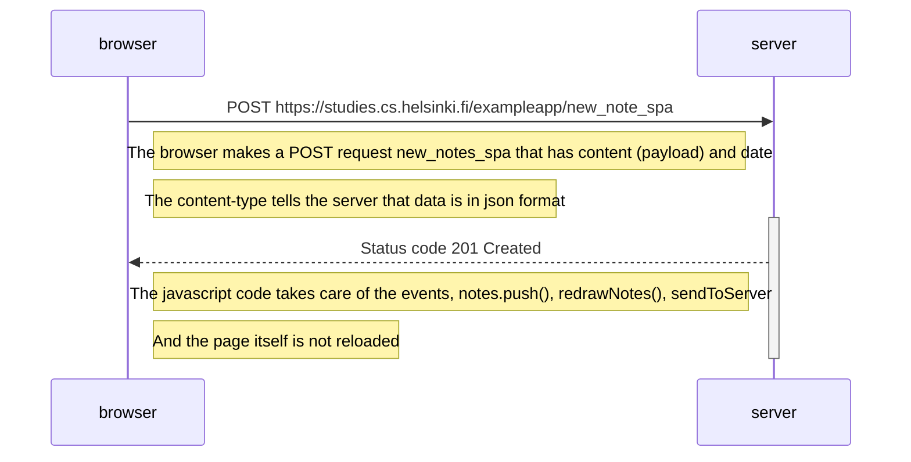

0.6: Uusi muistiinpano

```mermaid
sequenceDiagram
    participant browser
    participant server
 
    browser->>server: POST https://studies.cs.helsinki.fi/exampleapp/new_note_spa
    Note right of browser: The browser makes a POST request new_notes_spa that has content (payload) and date
    Note right of browser: The content-type tells the server that data is in json format

    activate server
    server-->>browser: Status code 201 Created
    Note right of browser: The javascript code takes care of the events, notes.push(), redrawNotes(), sendToServer
    Note right of browser: And the page itself is not reloaded
    deactivate server
```
